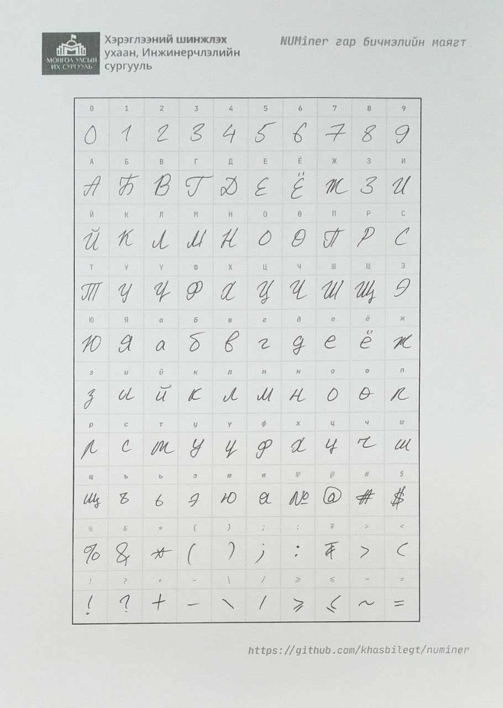
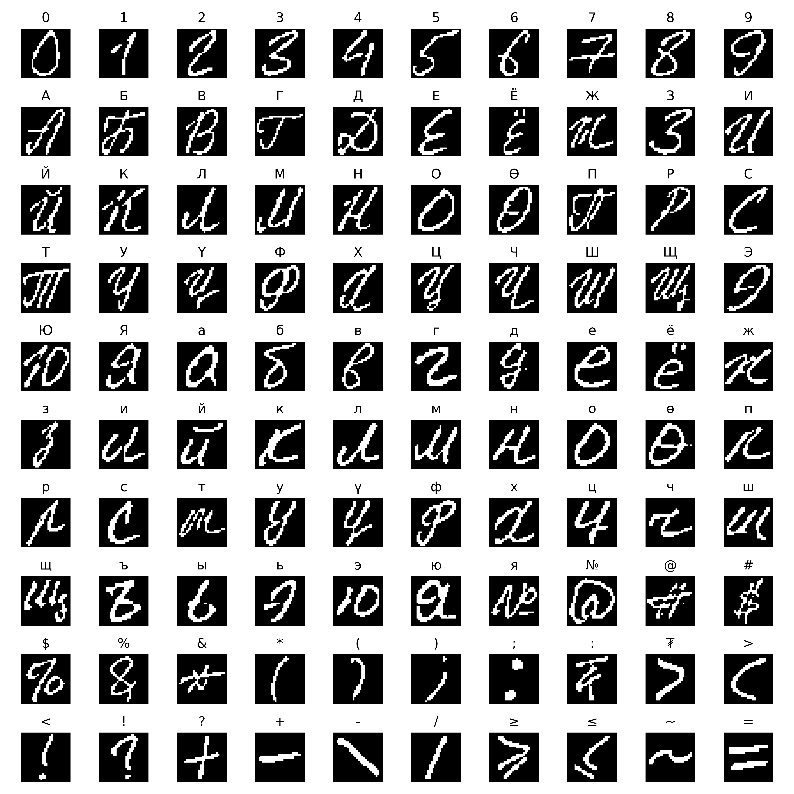
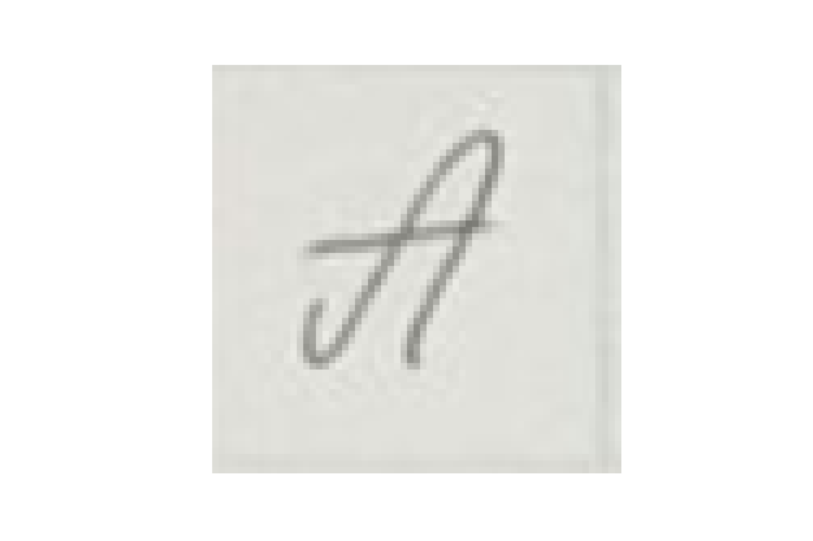
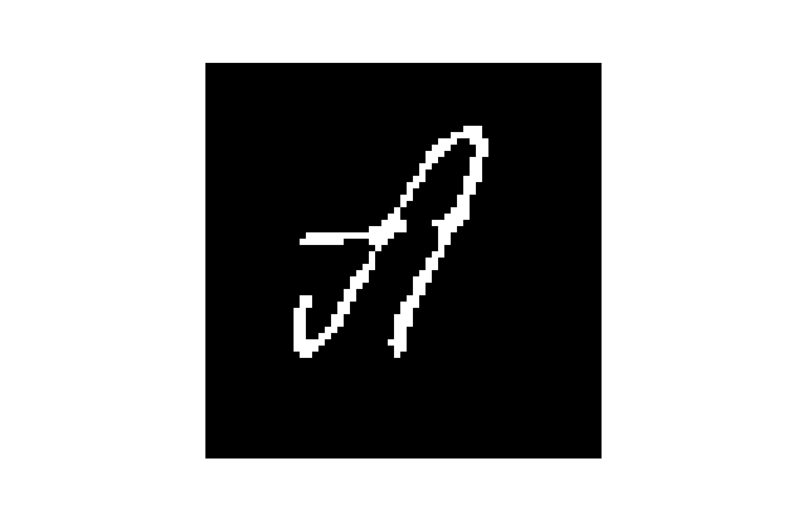
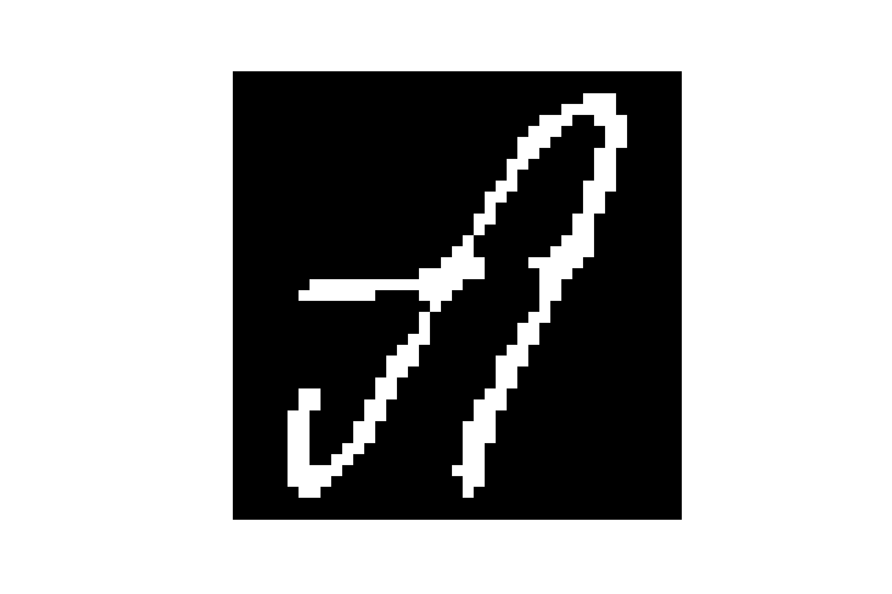
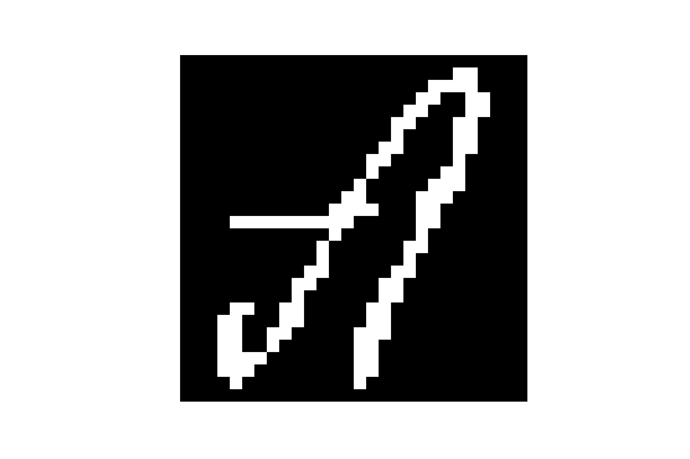

<h1 align="center">
  NUMiner
</h1>

<p align="center">
  <a href="https://travis-ci.org/khasbilegt/numiner">
    
  </a>
  <a href="https://github.com/PyCQA/bandit">
    
  </a>
  <a href="https://badge.fury.io/py/numiner">
    
  </a>
  <a href='https://coveralls.io/github/khasbilegt/numiner?branch=master'>
    
  </a>
  <a href='https://github.com/psf/black'>
    
  </a>
</p>

<p align="center">
  <a href="#installation">Installation</a> •
  <a href="#how-to-use">How To Use</a> •
  <a href="#sample-sheet-image">Sheet</a> •
  <a href="#contributing">Contributing</a> •
  <a href="#license">License</a>
</p>

<p align="center">This is a Python library that creates MNIST like training dataset for Handwritten Text Recognition related researches</p>

## Installation

Use the package manager [pip](https://pip.pypa.io/en/stable/) to install numiner.

```bash
$ pip install numiner
```

Use the package manager [pipenv](https://pypi.org/project/pipenv/) to install numiner.

```bash
$ pipenv install numiner
```

Use the package manager [poetry](https://pypi.org/project/poetry/) to install numiner.

```bash
$ poetry add numiner
```

## How To Use

In general, the package has two main modes. One is `sheet` and another one is `letter`.

`sheet` - takes a path called `<source>` to a folder that's holding all the scanned _sheet_ images or an actual image path and saves the processed images in the `<result>` path

```bash
$ numiner -s/--sheet <source> <result>
```

`letter` - takes a path called `<source>` to a folder that's holding all the cropped raw images or an actual image path and saves the processed images in the `<result>` path

```bash
$ numiner -l/--letter <source> <result>
```

Also you can override the default sheet labels by giving `json` file:

```bash
$ numiner --labels path/to/labels.json -s path/to/source path/to/result
```

For sure you can also do this:

```bash
$ numiner --help

usage: numiner [-h] [-v] [-s <source> <result>] [-l <source> <result>] [-c <path>]

optional arguments:
  -h, --help                    show this help message and exit
  -v, --version                 show program's version number and exit
  --clean <path>
  -s/--sheet <source> <result>  a path to a folder or file that's holding the <source>
                                sheet image(s) & a path to a folder where all <result>
                                images will be saved
  -l/--letter <source> <result> a path to a folder or a file that's holding the cropped
                                image(s) & a path to a folder where all <result> images
                                will be saved
  --labels <path>               a path to .json file that's holding top to bottom, left
                                to right labels of the sheet with their ids
```

```bash
$ numiner convert --help

usage: numiner convert [-h] -p <src> <dest> SIZE RATIO

positional arguments:
  SIZE                  number of images that each class contains
  RATIO                 test, train or percentage of the test data
                        in that case the rest of it will become
                        train data

optional arguments:
  -h, --help            show this help message and exit
  -p <src> <dest>, --paths <src> <dest>
                        source and destination paths
```

## Sample Sheet image

<p align="center">

</p>

You can also get the empty sheet file from [here](assets/sheet.pdf).

## Extracted letters from the sheet

<p align="center">

</p>

## Final image processing order

Followed the same approach that EMNIST used when they were first creating their dataset from NIST SD images.

1. Letter extracted from the sheet
2. Binary version of original image
3. Letter itself fitted into a square shape plus 2 pixel wide borders on each side without losing the aspect ratio
4. From previous step, image resized to 28x28 and taken threshold results in final image

<div align="center">
  
  
  
  
</div>

## Contributing

Pull requests are welcome. For major changes, please open an issue first to discuss what you would like to change.

Please make sure to update tests as appropriate.

If you want to read more about how this project came to life, you can check out my [thesis report](https://github.com/khasbilegt/thesis-report/blob/master/main.pdf).

## License

[MIT](https://choosealicense.com/licenses/mit/)
